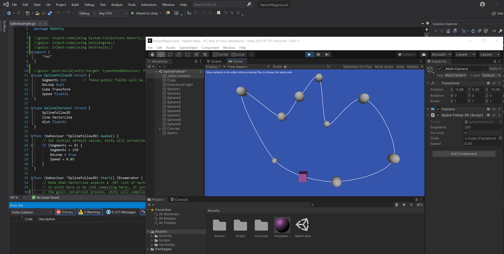

# GoUnity
GoLang Script Handler for Unity

### Using Golang as a scripting language for Unity

Using the [`go2cs`](https://go2cs.net/) source converter, you can use [Golang](https://golang.org/ref/spec) as a scripting language for the [Unity](https://unity.com/) gaming platform.

Initial Example:
* Source Golang-based Unity Script: [SplineExample.go](../src/GoUnity/SplineExample.go)
  * Script inspired by the following [C# Unity script](../src/GoUnity/OriginalScript.cs) example included with the [Vectrosity](https://assetstore.unity.com/packages/tools/particles-effects/vectrosity-82) asset
* Current [`go2cs`](https://go2cs.net/) Converted C# Script: [SplineExample.cs](../src/GoUnity/SplineExample.cs)
  * _Conversion is_very close!! Just need some `directive` parsing and grammar update for Go generics added to [`go2cs`](https://go2cs.net/)_
* Desired (Operational) Conversion: [SplineExample-DesiredTarget.cs](../src/GoUnity/SplineExample-DesiredTarget.cs)
* Target Unity Script ([`MonoBehaviour`](https://docs.unity3d.com/ScriptReference/MonoBehaviour.html) class wrapper for converted struct): [SplineFollow3D.cs](../src/GoUnity/SplineFollow3D.cs)
* Initial Go-based MonoBehaviour: [MonoBehaviour.go](../src/GoUnity/MonoBehaviour.go)

